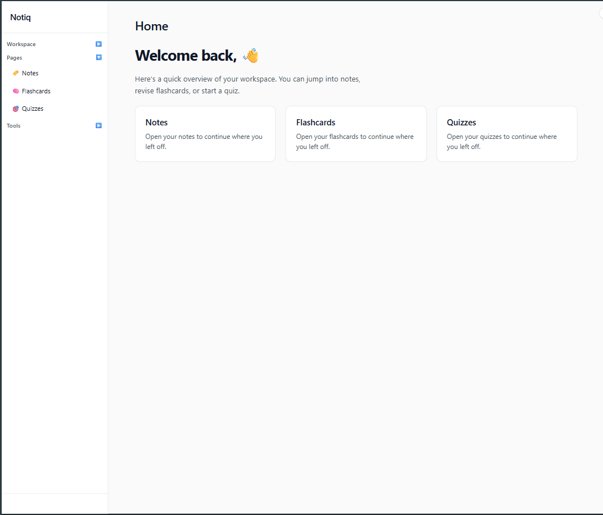

###  
# Notiq 

[](https://github.com/yourusername/notiq) 
[](LICENSE)
[](https://github.com/yourusername/notiq/actions)
[](https://github.com/yourusername/notiq/issues)
[](https://github.com/nxora/Notiq/Notiq)

---

## Overview

**Notiq** is a modern, lightweight, and highly customizable notification manager designed to keep you organized and productive. Whether you’re tracking tasks, reminders, or alerts from multiple sources, Notiq brings everything into one sleek interface.

With a focus on speed, reliability, and user experience, Notiq helps you stay on top of your day without distraction.

---

## Features ✨

- **Multi-source notifications** – Aggregate alerts from apps, email, and IoT devices.
- **Custom Reminders** – Set one-time or recurring reminders with ease.
- **Priority Management** – Categorize notifications by importance.
- **Offline Support** – Never miss a notification even without an internet connection.
- **Cross-Platform** – Works seamlessly on Windows, macOS, and Linux.

---

## Screenshots 🖼️

 

---

## Installation 💻

### From Source
```bash
git clone https://github.com/yourusername/notiq.git
cd notiq
npm install
npm run dev
```

# Start Notiq
```cd

npm run dev
```
 
Contributing 🤝

Contributions are welcome! Please read the Contributing Guide
 before submitting a PR.

Fork the repository

Create your feature branch: git checkout -b feature/MyFeature

Commit your changes: git commit -m 'Add some feature'

Push to the branch: git push origin feature/MyFeature

Open a Pull Request

License 📄

This project is licensed under the MIT License
.

Contact ✉️ [Daveora](https://github.com/davex-ai)
 – feel free to reach out!
